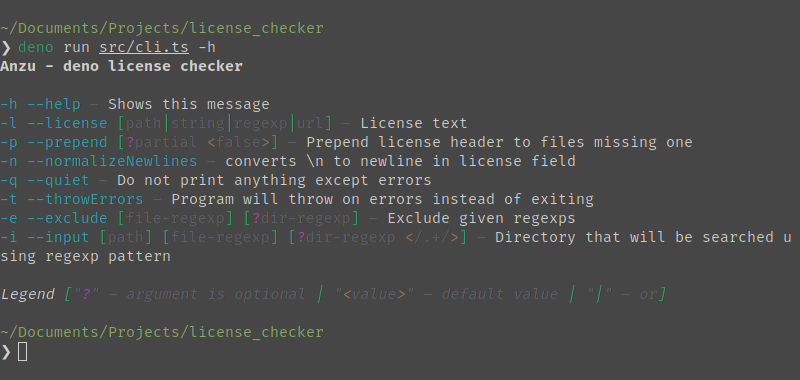
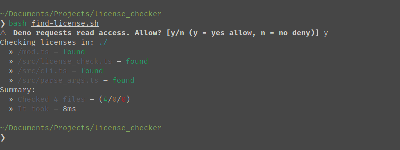

# 📝 Anzu

Anzu is very light CLI tool for checking whether files have license header

## Installation

Remember you have to have deno path set when installing. Do it using this bash
command: `echo 'export PATH="$HOME/.deno/bin:$PATH"' >> ~/.bashrc` You may want
to replace `~/.bashrc` with your shell rc config, eg. `~/.zshrc` for zsh

- Without explicit permissions:
  - `deno install -n anzu https://deno.land/x/anzu@$MODULE_VERSION/src/cli.ts`
- With explicit permissions:
  - `deno install -n anzu --allow-read --allow-write --allow-net https://deno.land/x/anzu@$MODULE_VERSION/src/cli.ts`
- You can also do `deno run https://deno.land/x/anzu@$MODULE_VERSION/src/cli.ts`
  without actually installing it

## 📚 Why not [deno_license_checker](https://github.com/kt3k/deno_license_checker)

I got discouraged from deno_license_checker because of several things, majorly:

- Its size – 177KB
- Performance
- Requirement of config file
- Doesn't ask for permissions – they have to be specified otherwise it'll exit

Anzu solves some of these problems:

- It's significantly smaller – 27KB
- In my case its multiple times faster (benchmarks needed)
- Every option has to be set in CLI
- If you want to launch same command using one command – just create bash script
  that does that (see [here](./find-license.sh))
- If permissions aren't specified it automatically requests you for them

Why not Anzu?

- It's not compatible with windows (Im 99.9% sure, but didn't tested it)
- If you prefer having external config file Anzu probably isn't for you

What can Anzu also do?

- Additionally it can load license template from given URL and Path
- It can search for license using RegExp
- Exclude files and directories using regexp
- You can see full functionality using `-h` option.

## 🤝 Contributing

I'm open to any idea and criticism. Feel free to add any commits, issues and
pull requests!

## 📝 Licensing

This project is available under MIT License conditions.
